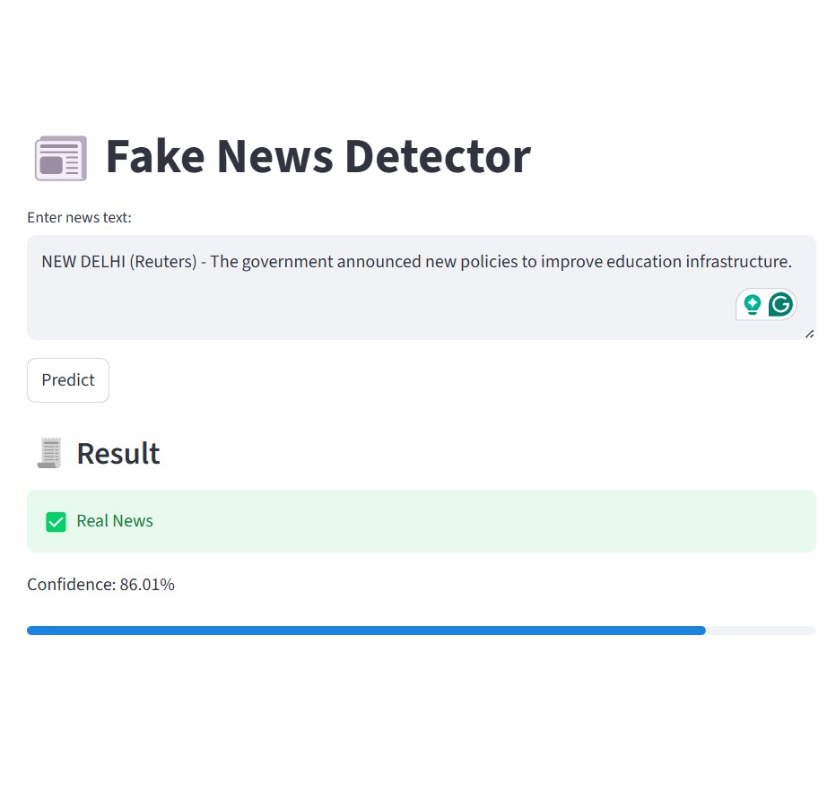

# 📰 Fake News Detection System

## 📌 Overview

This project is a Machine Learning-based web application that detects whether a news article is **Real or Fake** using Natural Language Processing (NLP).

The model is trained using **TF-IDF Vectorization** and **Logistic Regression**, and deployed using Streamlit for real-time predictions.

---

## 🚀 Features

* 🔍 Enter any news text
* 🤖 Predict Real or Fake
* 📊 Shows confidence score
* 🌐 Simple and interactive UI

---

## 🛠️ Tech Stack

* Python
* Pandas, NumPy
* Scikit-learn
* Streamlit
* NLP (TF-IDF)

---

## 📸 Project Screenshot



---

## ▶️ How to Run Locally

1. Clone the repository:

```
git clone https://github.com/SANYAPAL26/fake-news-detector.git
```

2. Navigate to project folder:

```
cd fake-news-detector
```

3. Install dependencies:

```
pip install -r requirements.txt
```

4. Train the model:

```
python train_model.py
```

5. Run the app:

```
streamlit run app.py
```

---

## ⚠️ Note

Dataset and model files are not included due to GitHub size limits.
They will be generated automatically when running the project.

---

## 📈 Model Details

* Algorithm: Logistic Regression
* Vectorizer: TF-IDF
* Accuracy: ~98%

---

## 👩‍💻 Author

**Sanya Pal**

---
